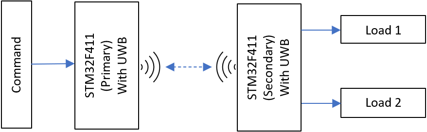
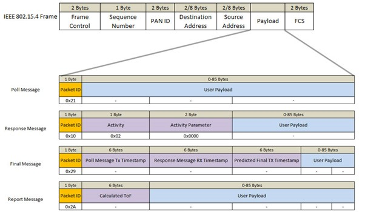
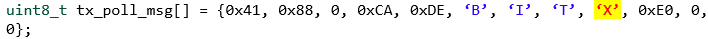
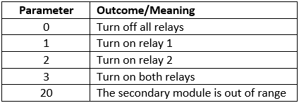

# TurnOnAlong (Wireless Remote Switch)

## Demo

## Introduction:
The Turnonalong is a device that will wirelessly control power to a remote device within a configurable safe distance. The distance has a centimeter-level accuracy thanks to the UWB (Ultra-Wideband) technology.  

## Proposed Solution
* Read and send a command from the primary module to the remote/secondary module wirelessly via the UWB RF transceiver.
* The secondary module will perform the command, such as to turn on or off of one or two relays.
* The distance will be checked by the secondary module to ensure that the signal is not spurious.
* The result of the command is sent back via RF to the primary device so that indicator LEDs can be maintained.

## Overall Architecture

## Technology/Key Components Used
This project uses STM32F411 type microcontrollers for computing tasks. For wireless communication, Qorvo DWM3000 UWB shields are used. These UWB modules utilize the SPI protocol to communicate with their host microcontrollers. The reason to use UWB over other common wireless communication technologies is because they can measure distances with centimetre-level accuracy in addition to transmitting data.

## Wireless Data Communication
Communication between STM32F411 and the DWM3000 UWB module has been done using drivers provided by the manufacturer of these modules, Qorvo.
According to these drivers, the wireless data transmission between the primary and secondary modules is achieved by sending messages back and forth that are encapsulated within IEEE 802.15.4 frame, as shown below:
  

The PAN ID data frame is manipulated to embed parameters that allow:
* To control external loads at the secondary module using the data sent by the primary module.
* Sending feedback to the primary module from the secondary module.  

Here is an example message used in the project:  
  
An unsigned integer parameter value will replace the highlighted X byte as needed.  

Currently supported values are:  
  
